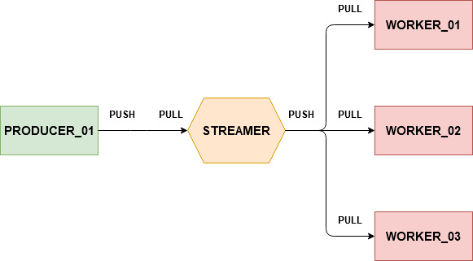

# Parallelized Pipeline Messaging using ZeroMQ and Docker Containers



## Build

```sh
~/zmq-docker-streamer$ docker-compose build
```

## Scale

```sh
~/zmq-docker-streamer$ docker-compose scale worker=2
Creating and starting zmqdockerstreamer_worker_1 ... done
Creating and starting zmqdockerstreamer_worker_2 ... done
```

## Run

```sh
~/zmq-docker-streamer$ docker-compose up
Starting zmqdockerstreamer_producer_1
Starting zmqdockerstreamer_device_1
Starting zmqdockerstreamer_end_of_pipeline_1
zmqdockerstreamer_worker_2 is up-to-date
zmqdockerstreamer_worker_1 is up-to-date
Attaching to zmqdockerstreamer_worker_2, zmqdockerstreamer_worker_1, zmqdockerstreamer_producer_1, zmqdockerstreamer_end_of_pipeline_1, zmqdockerstreamer_device_1
worker_2           | I am worker #2198
device_1           | running streamer device 1
device_1           | running streamer device 2
worker_1           | I am consumer #1259
end_of_pipeline_1  | I am end #4027
worker_1           | {'worker': 9001, 'num': 7}
end_of_pipeline_1  | {'end_of_pipeline_id': 4027, 'worker_id': 9001, 'num': 7}
worker_1           | {'worker': 9001, 'num': 8}
end_of_pipeline_1  | {'end_of_pipeline_id': 4027, 'worker_id': 9001, 'num': 8}
worker_2           | {'worker': 2198, 'num': 9}
end_of_pipeline_1  | {'end_of_pipeline_id': 4027, 'worker_id': 2198, 'num': 9}
worker_1           | {'worker': 9001, 'num': 10}
end_of_pipeline_1  | {'end_of_pipeline_id': 4027, 'worker_id': 9001, 'num': 10}
worker_2           | {'worker': 2198, 'num': 11}
end_of_pipeline_1  | {'end_of_pipeline_id': 4027, 'worker_id': 2198, 'num': 11}
worker_1           | {'worker': 9001, 'num': 12}
end_of_pipeline_1  | {'end_of_pipeline_id': 4027, 'worker_id': 9001, 'num': 12}
worker_2           | {'worker': 2198, 'num': 13}
end_of_pipeline_1  | {'end_of_pipeline_id': 4027, 'worker_id': 2198, 'num': 13}
worker_1           | {'worker': 9001, 'num': 14}
end_of_pipeline_1  | {'end_of_pipeline_id': 4027, 'worker_id': 9001, 'num': 14}
worker_2           | {'worker': 2198, 'num': 15}
end_of_pipeline_1  | {'end_of_pipeline_id': 4027, 'worker_id': 2198, 'num': 15}
worker_1           | {'worker': 9001, 'num': 16}
end_of_pipeline_1  | {'end_of_pipeline_id': 4027, 'worker_id': 9001, 'num': 16}
```